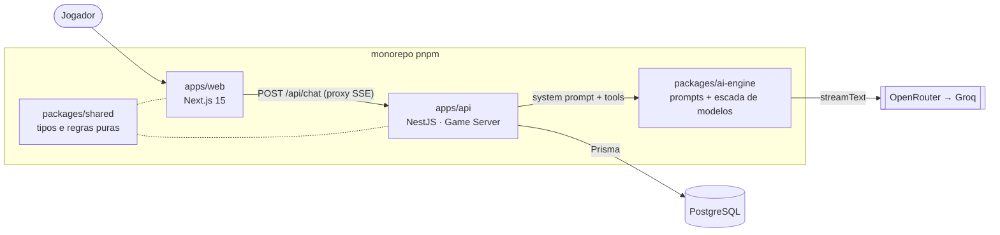

# AI Dungeon Master (AI DM)

Mestre de RPG narrativo movido a IA. O agente narra, arbitra as regras e guarda a memória
da campanha — hoje com D&D 5e via SRD.

Regra de ouro do projeto: **o estado de jogo nunca vive no LLM.** Ficha, inventário, cena e
rolagens são autoritativos no servidor; o LLM só narra. Toda alteração de estado passa por
uma tool que executa em código.

> **Fase atual:** Fase 1 — MVP single-player. Em produção: [ai-dm-web.vercel.app](https://ai-dm-web.vercel.app).

## Arquitetura



- **[apps/web](apps/web)** — Next.js 15 (App Router) e Auth.js. Renderiza a mesa e faz o
  proxy do stream em [src/app/api/chat/route.ts](apps/web/src/app/api/chat/route.ts).
  Deliberadamente **não** tem estado de jogo nem fala com o banco: o que ele mostra veio
  do stream ou de um `GET` da API.
- **[apps/api](apps/api)** — NestJS. É o Game Server: dono do banco, das rolagens
  ([src/game/dice.service.ts](apps/api/src/game/dice.service.ts)) e das tools do DM
  ([src/ai/ai.service.ts](apps/api/src/ai/ai.service.ts)). Monta o prompt, chama o modelo
  e devolve SSE. **Não** delega decisão mecânica ao LLM — o modelo diz *o que* testar, o
  servidor diz *quanto deu*.
- **[packages/ai-engine](packages/ai-engine)** — prompts do Mestre, escada de fallback de
  modelos ([src/model.ts](packages/ai-engine/src/model.ts)) e a rubrica dos evals. É uma
  biblioteca pura: **não** tem acesso ao banco nem DI do Nest, por isso as tools vivem na
  API e não aqui.
- **[packages/shared](packages/shared)** — tipos do contrato client-server e regras
  determinísticas (dados, atributos, magias), importado pelos dois apps. **Não** tem I/O.
- **PostgreSQL** — o estado autoritativo. Schema e migrações em
  [apps/api/prisma](apps/api/prisma).

### Um turno, ponta a ponta

```mermaid
sequenceDiagram
  participant J as Jogador
  participant W as apps/web
  participant A as apps/api
  participant M as LLM
  participant DB as PostgreSQL

  J->>W: "Abro a porta com cuidado."
  W->>A: POST /api/v1/ai/chat (JWT da sessão)
  A->>DB: ficha, cena, entidades, quests, histórico
  A->>M: system estático + histórico + bloco de estado do turno
  M-->>A: tool call rollDice(skill)
  A->>A: dice.service rola o d20; o modificador vem da ficha
  A-->>M: resultado da rolagem
  M-->>A: narração, token a token
  A-->>W: SSE (texto, rolagem, HP, inventário)
  W-->>J: narração aparecendo + opções
  A->>DB: ao fim do turno, grava ACTION e NARRATION no EventLog
```

O prompt é montado em camadas por volatilidade (estático → constante por personagem →
estado do turno) para o prefixo ficar cacheável — o porquê está em
[docs/adr/007-camadas-do-prompt-por-volatilidade.md](docs/adr/007-camadas-do-prompt-por-volatilidade.md).

### Onde o estado vive

Tudo no PostgreSQL, modelado em [apps/api/prisma/schema.prisma](apps/api/prisma/schema.prisma):

| Estado | Onde | O LLM pode alterar? |
|---|---|---|
| Ficha, classe, magias conhecidas | `Character` | Não (criação e edição são REST) |
| HP, inventário, estado da cena | `CharacterState` | Só via tool (`updateCharacterHp`, `updateInventory`, `updateScene`) |
| Entidades do mundo (NPCs, locais) | `Adventure.entities` | Só via tool (`recordEntity`) |
| Quests | `Quest` | Não |
| Histórico e resumo da campanha | `EventLog`, `Adventure.memorySummary` | Não — o servidor grava e resume |
| Regras e magias do SRD | `System` (ingerido por `pnpm srd:ingest`) | Não, só leitura via tool |
| Rolagens | não persistem: geradas no servidor a cada turno | Nunca — o LLM não gera número |

O LLM recebe uma cópia desse estado a cada turno e devolve texto e tool calls. Nada do que
ele "lembra" é fonte de verdade. As tools vivas e o contrato que o modelo lê estão em
[apps/api/src/ai/ai.service.ts](apps/api/src/ai/ai.service.ts) — a lista canônica é o
código, não este arquivo.

## Começando

```bash
pnpm install
pnpm db:migrate
pnpm dev
```

`DATABASE_URL` e as chaves dos provedores de LLM vão no `.env` da **raiz** — a API não
carrega `.env` sozinha, ver [AGENTS.md](AGENTS.md). Nunca commite segredos.

Comandos do dia a dia: `pnpm test` (unitários e integração), `pnpm eval` (qualidade da
narração, com LLM-judge), `pnpm typecheck`, `pnpm docs:links` (gate de links dos docs).
A lista completa é a seção `scripts` do [package.json](package.json).

Uma armadilha: a API consome o **build** de [packages/ai-engine](packages/ai-engine), não o
fonte. Editar o pacote sem rodar o build dele não tem efeito nenhum na API.

## Produção

Três provedores, todos em plano gratuito (ADR
[006-deploy-custo-zero.md](docs/adr/006-deploy-custo-zero.md)):

| Onde | O que hospeda | O que o plano impõe |
|---|---|---|
| Vercel | [apps/web](apps/web) | Hobby corta função em 10s: o proxy SSE precisa de `maxDuration = 60` e `X-Accel-Buffering: no` ([route.ts](apps/web/src/app/api/chat/route.ts)) |
| Render | [apps/api](apps/api) | Free não tem *pre-deploy*: `prisma migrate deploy` roda no `buildCommand` ([render.yaml](render.yaml)); cold start de ~1 min |
| Neon | PostgreSQL | usar a URL *direct*, não a pooled |

Provedores de LLM: OpenRouter (primário e fallback) e Groq (terceiro nível), na escada de
[packages/ai-engine/src/model.ts](packages/ai-engine/src/model.ts).

## Mapa de leitura

- Vai mexer em **regra ou tool do Mestre** → [apps/api/src/ai/ai.service.ts](apps/api/src/ai/ai.service.ts) e [AGENTS.md](AGENTS.md).
- Vai mexer no **texto do Mestre** → [packages/ai-engine/src/prompts](packages/ai-engine/src/prompts), e rode `pnpm eval`.
- Vai mexer no **banco** → [apps/api/prisma/schema.prisma](apps/api/prisma/schema.prisma) e migração versionada (nunca edite uma existente).
- Quer o **porquê** de uma decisão → [docs/adr](docs/adr); o produto está em [docs/prd.md](docs/prd.md).
- Vai implementar uma **feature** → o user story em [docs/sdlc/01-requisitos](docs/sdlc/01-requisitos) manda; escreva o teste antes.
- Vai mexer nos **evals** → [evals](evals) tem quatro modos independentes, mapeados na [US-90](docs/sdlc/01-requisitos/US-90-readme-de-evals-com-mapa-do-subsistema.md).

Convenções completas em [AGENTS.md](AGENTS.md) e [CLAUDE.md](CLAUDE.md). Commits em
Conventional Commits.

## Roadmap

Só o item 1 existe hoje; os outros são futuro.

1. **MVP single-player** ← atual
2. Memória entre aventuras (EventLog + RAG)
3. Upload de livros de RPG, com worker de ingestão
4. Multiplayer, até 10 personagens na mesma mesa
5. Multiverso (duplicação de personagem entre campanhas)
6. Provider oficial D&D
